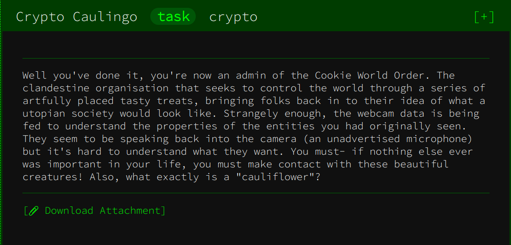

# Crypto Caulingo - Google CTF Beginner's Quest
## RSA with constraint on primes


This is a nice challenge where we get an RSA public key along with an encrypted message that we need to decrypt. The primes `P, Q` composing the modulus are subject to the following constraint:
```
|A*P-B*Q| < 10000, with 1 <= A,B <= 1000.
```
bla

