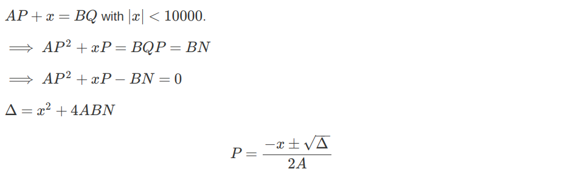
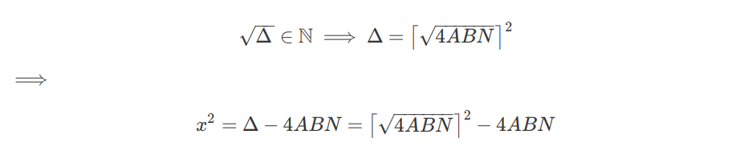

# Crypto Caulingo - Google CTF Beginner's Quest
## RSA with constraint on primes


This is a nice challenge where we get an RSA public key along with an encrypted message that we need to decrypt. The primes `P, Q` composing the modulus are subject to the following constraint:
```
|A*P-B*Q| < 10000, with 1 <= A,B <= 1000.
```
We transform this constraint into a second degree polynomial with unknown `P` as follows:


The discriminant `Δ` must be a perfect square for `P` to be an integer. We can therefore bruteforce `A,B,x` until we get a perfect square `Δ`.

However, this would take forever to run (~1 day on my laptop). So we can be a little more clever and realize that since `x**2 << 4*A*B*N`, if the square root of `Δ` is integer, it must the ceiling of the square root of `4*A*B*N`. In turn, this implies that we only need to check that the difference between `4*A*B*N` and the square of the ceiling of its square root is a perfect square, namely `x**2`. Hopefully, it is clearer in LaTeX:

Therefore, we only need to check that the right-hand side is a perfect quare. If that is the case, its square root is `x`. Thus, we have just removed `x` from the parameters needed to bruteforce! We thus just need to bruteforce over `A` and `B`, which are both less than 1000. This is definitely manageable!

To recapitulate:
- We write `P` as the solution of a quadratic equation with 3 small unkown parameters `A,B,x`. 
- We need to remove one of these parameters to bruteforce quickly.
- Since `P` is integer, the discriminant is a perfect square.
- Since `Δ` is a perfect square and `x` is small compared to `N`, the value of `x` is determined entirely by `A,B` and `N`.
- With this observation, we just need to bruteforce on `A` and `B`, which is done in less than 1 minute on my laptop.

That was fun! Here is a python script that does exactly that:
```python
from Crypto.Util.number import inverse, long_to_bytes,isPrime
from sympy import integer_nthroot

N = 17450892350509567071590987572582143158927907441748820483575144211411640241849663641180283816984167447652133133054833591585389505754635416604577584488321462013117163124742030681698693455489404696371546386866372290759608301392572928615767980244699473803730080008332364994345680261823712464595329369719516212105135055607592676087287980208987076052877442747436020751549591608244950255761481664468992126299001817410516694015560044888704699389291971764957871922598761298482950811618390145762835363357354812871474680543182075024126064364949000115542650091904557502192704672930197172086048687333172564520657739528469975770627
e = 65537

c = 0x50fb0b3f17315f7dfa25378fa0b06c8d955fad0493365669bbaa524688128ee9099ab713a3369a5844bdd99a5db98f333ef55159d3025630c869216889be03120e3a4bd6553d7111c089220086092bcffc5e42f1004f9888f25892a7ca007e8ac6de9463da46f71af4c8a8f806bee92bf79a8121a7a34c3d564ac7f11b224dc090d97fdb427c10867ad177ec35525b513e40bef3b2ba3e6c97cb31d4fe3a6231fdb15643b84a1ce704838d8b99e5b0737e1fd30a9cc51786dcac07dcb9c0161fc754cda5380fdf3147eb4fbe49bc9821a0bcad98d6df9fbdf63cf7d7a5e4f6cbea4b683dfa965d0bd51f792047e393ddd7b7d99931c3ed1d033cebc91968d43f

def get_params(N):
  for A in range(1,1001):
    for B in range(1,1001):
      almost_disc = 4*A*B*N
      intsqrt_almost_disc = integer_nthroot(almost_disc,2)[0] + 1
      maybe_x = integer_nthroot(intsqrt_almost_disc**2-almost_disc,2)
      if maybe_x[1]:
        x = maybe_x[0]
        return A,B,x

A, B, x = get_params(N)

def get_primes(A,B,x,N):
  '''
  The quadratic equation has two roots. We need to check both to be sure to find P.
  Also, in the function above, we assumed x was positive. This is not
  necessarly the case, so we need to check with both x and -x.
  '''
  disc = 4*A*B*N + x**2
  sqrt_disc = integer_nthroot(disc,2)[0]
  for sign_d in [-1,1]: # sign of discriminant
    for sign_x in [-1,1]: # sign of x
      P = (sign_x*x + sign_d*sqrt_disc)//(2*A)
      if isPrime(P) and N%P==0:
          return P, N//P

P, Q = get_primes(A,B,x,N)
d = inverse(e, (P-1)*(Q-1))
m = pow(c, d, N)
print(str(long_to_bytes(m),'utf-8'))
```

