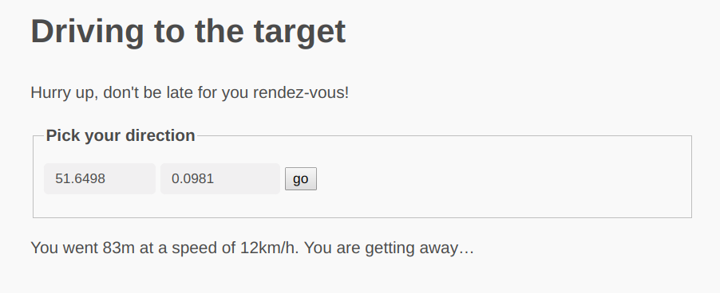

# Drive to the target - GoogleCTF Beginner's Quest
# Geographical gradient descent


The site gives us inputs for latitude and longitude and we need to move to the target modifying these two variables. When submiting new coordinates, the server responds as follows:
- You are getting closer to the target.
- You are getting away from the target.
- You are moving too fast.
- You are trying to move too far.




Before trying anything clever, I wrote a script that implements a crappy version of gradient descent. It takes small steps towards a direction, and randomly changes that direction if the server says we are getting away from the target:
```python
# sol.py
import requests as req
import re
import time
import random

url = 'https://drivetothetarget.web.ctfcompetition.com/'
x = req.get(url)
la, lo = 1, 0 # Which coordinates should we follow?
while True:
    par = re.findall('value="(.*?)"',x.text)
    params = {}
    params['token']=par[2]
    params['lat']=float(par[0])-la*0.00004
    params['lon']=float(par[1])-lo*0.00004

    x = req.get(url,params=params)

    give_me_flag = re.findall(r'CTF{.*?}',x.text)
    if give_me_flag: # Is the flag in the response?
        print(give_me_flag[0])
        break

    if 'You are getting away' in x.text: # If we are moving away...
        while True: # Change the direction to a random (non-zero) one.
            la, lo = random.choice([-1,0,1]), random.choice([-1,0,1])
            if la*lo != 0:
                break
    time.sleep(0.2) # Sleep to avoid going too fast.
```
This script takes very small steps (too avoid the `This is too fast!` message). We're starting somewhere in the UK, so if the target is, e.g., in Hawaii, it will never finish. But anyway, it's worth a shot so I let it run in the background.

I then tried to understand how the backend works. The server keeps track of the time of our requests to compute the speed. If I move 100 meters 0.1 seconds after my previous request, the server will compute my speed as 3600km/h and say I'm going too fast. The server knows my time and coordinates using a token in the url. Here is a typical url:
```
https://drivetothetarget.web.ctfcompetition.com/?lat=51.6498&lon=0.0981&token=gAAAAABdEm9YSRgh-i8a2qngIptlBaIOO0BGjs_CVT9ko7THOYM6FZICmBQvSJXbl0F_iVLqjCQb21DaVcqeWoclwadmk96IZ7Nov1UJtiLaZGEz38ACRCCPCrf4x7Fg714ZWETvfIGT
```
When base64 decoding this token, we get the following hex string:
```
80000000005d126f58491821fa2f1adaa9e0229b6505a20e3b40468ecfc2553f64a3b4c739833a15920298142f4895db97417f8952ea8c241bdb50da55ca9e5a8725c1a76693de8867b368bf5509b622da646133dfc00244208f0ab7f8c7b160ef5e195844ef7c8193
```
This is a mess and it appears to change randomly at each request. The only part that is stable is the first 9 bytes, in this case `80000000005d126f58`. And surprise, `0x5d126f58=1561489240` is the epoch time of the request. So that is how the server keeps track of the time. 

I thought I had the solution right there: Just manually change the time of the request to, say, 1 hour later, and the server will think that I've made my 100 meters at 0.1km/h instead of 3600km/h. But that failed miserably... Apparently, the time also has an influence on the rest of the token. I'm thinking about a hash or HMAC for example, maybe linked with the coordinates. So I tried to research that and understand that mysterious token.

But that's right about when my initial crappy script terminated... with the flag! It took around 1h30, but to my surpise it worked. The target seems to be in the center of London.

There is probably a smarter way to solve this challenge, but my crappy 30 lines script did it, so... oh well.
```bash
$ time python sol.py
CTF{Who_is_Tardis_Ormandy}

real    89m23.916s
user    10m34.976s
sys 0m25.452s
```

Note: After googling `Tardis Ormandy`, it seems that `Ormandy` is time machine in the TV show Dr. Who. This gives an hint that the 'true' solution indeed involves hacking the time in the token. I'll try to keep researching that direction.
