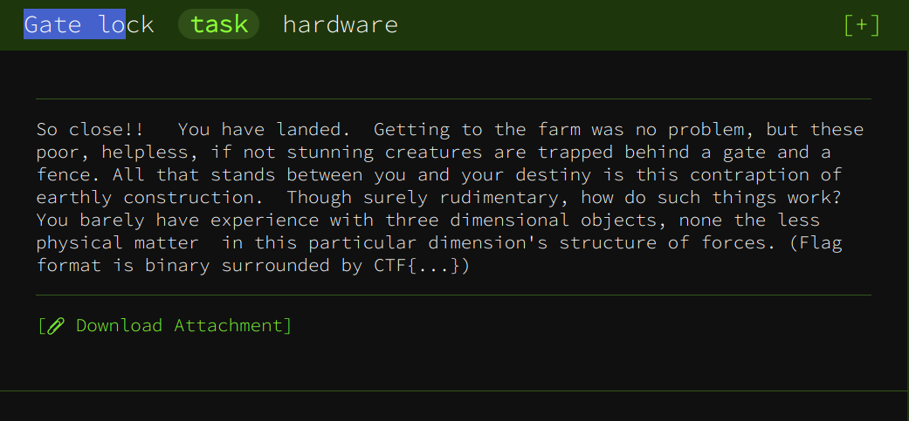
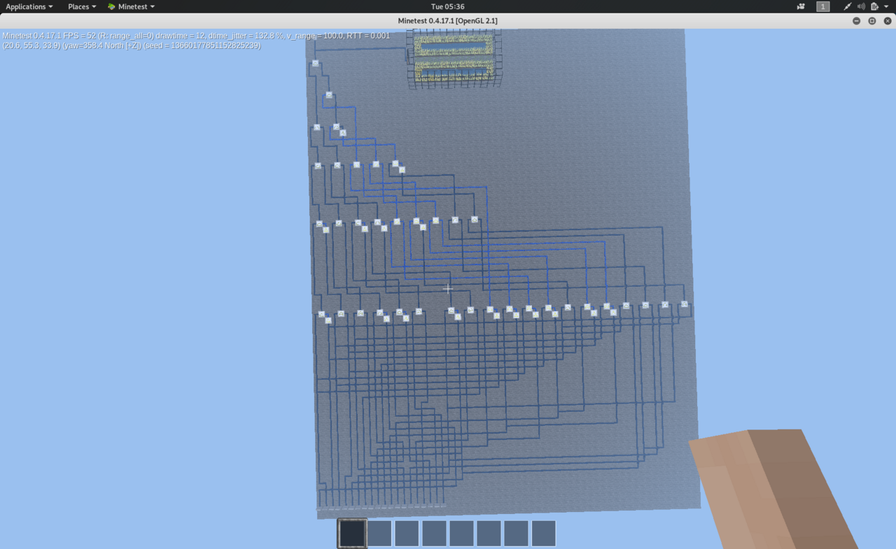
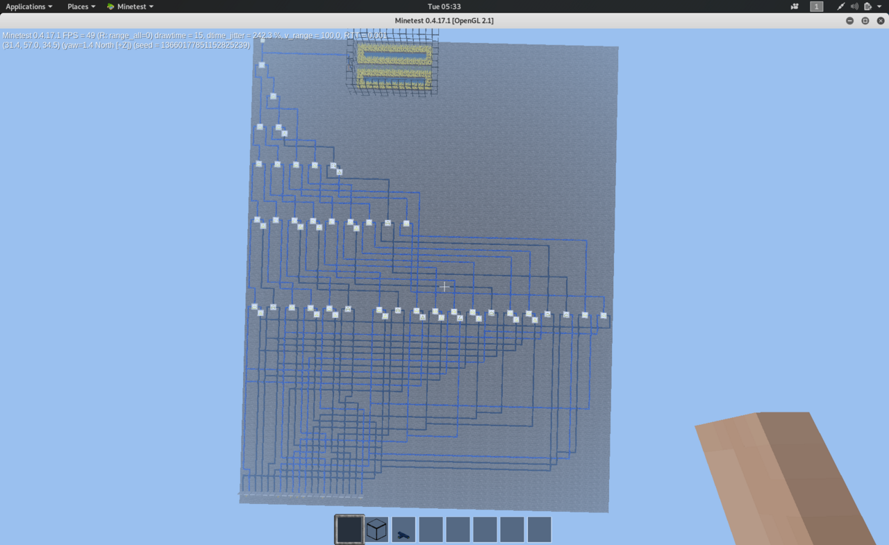

# Gate lock - Google CTF Beginner's Quest
## Boolean satisfiability problem in Minetest



Ok, this one was a pain in the ass... We get a Minetest (a Minecraft-like game) world. We open this world in Minetest and arrive at a platform containing a large boolean circuit:

The input consists of 20 levers, and we need to find an assignement Up/Down of these levers to light up the final wire of this circuit.

There are 2^20 configurations of levers, which is around 1 million. So this is easily bruteforceable (we could also use Z3 to be fancy). The only question is: how do we simulate the circuit?

After spending some time looking how to write scripts in Minetest, get the map data, or just use a bot, I decided it would just be easier to write the circuit on a sheet of paper and transcript it in python. So I did just that...

After this tedious, boring job, solving the challenge is easy. Here is the python implementation:
```python

m itertools import product

def first_stage(x):
    return [
        x[2] and not x[3],
        x[4] or x[5],
        x[14] or x[6],
        x[9] and not x[1],
        x[20] and not x[18],
        x[17] or x[19],
        x[7] and not x[6],
        x[16] or x[8],
        x[10] or not x[2],
        x[12] or not x[4],
        x[2] or not x[10],
        x[5] or not x[13],
        x[11] and x[3],
        x[13] or not x[5],
        x[4] or not x[12],
        x[14] and x[6],
        x[15] and x[7],
        x[15] or x[7],
        x[11] or x[3]
    ]

def second_stage(x):
    return [
        x[1] and not x[2],
        x[3] and x[4],
        x[5] and not x[6],
        x[7] and not x[8],
        x[10] and x[11],
        x[12] and not x[13],
        x[14] and x[15],
        x[16] or x[17],
        x[18] and x[19]
    ]

def third_stage(x,f):
    return [
        x[1] and x[2],
        x[3] and x[4],
        x[5] and f[9],
        x[6] and x[7],
        x[8] or not x[9]
    ]

def fourth_stage(x):
    return [
        x[1] and x[2],
        x[4] and not x[5]
    ]

def circuit(arr):
    f = first_stage(arr)
    f = [None] + f
    s = second_stage(f)
    s = [None] + s
    t = third_stage(s,f)
    t= [None] + t
    f4 = fourth_stage(t)
    last = f4[0] and (f4[1] and t[3])
    return last

def solution():
    for arr in product([True,False],repeat=20):
        l = list(arr)
        l = [None] + l
        if circuit(l):
            return arr

sol = solution()
print('CTF{{{}}}'.format(
    ''.join(['1' if sol[i] else '0' for i in range(20)])
    ))
```
which outputs the flag `CTF{01000010111001000001}`. And here is the final configuration:

